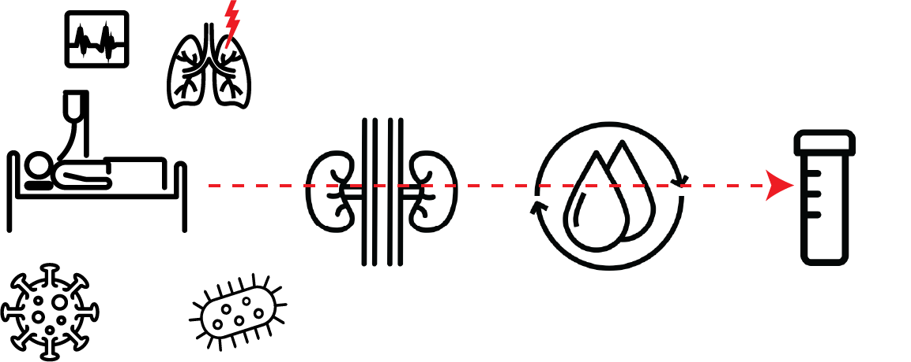

# Urine-based multi-omic comparative analysis of COVID-19 and bacterial sepsis-induced ARDS

This repository contains scripts for the analysis and figure generation of the paper  **Batra\*, Uni\* et. al.** Urine-based multi-omic comparative analysis of COVID-19 and bacterial sepsis-induced ARDS (2022), *Medrxiv*.

# Content

Execute scripts in order. The code will first compute all result tables and then generate the paper figures. For script 4, a running Cytoscape session is required to generate the network files.

| **Script name**                  | **Description**                                                        |
| :--- | :--- |
| 1_between_ards.R         | Molecular comparison of the two ARDS groups for all omics layers   |
| 2_within_ards.R          | Molecular signatures per clinical manifestation in each ARDS group |
| 3_figure_1.R             | Generates Figure 1                                                |
| 4_figure_2.R             | Generates Figure 2                                                |
| 5_figure_3.R             | Generates Figure 3                                  |
| custom_functions.R       | Internal functions, will be sourced by other scripts               |
|||
| **Folder**                   | **Description**                                                    |
| input                        | Needs to contain omics and clinical data (see below)               |
| results                      | Will contain output files                                          |
|||                              |                                                                    |
| **Output files in results/** | **Description**                                                    |
| tmp\*                        | Intermediate files used in follow-up scripts                       |
| Figure\*                     | Figure panels                                                      |
| supplementary\*              | Supplementary files                                                |

# Data

The input data used in this manuscript can be obtained from: https://doi.org/10.6084/m9.figshare.20260998.v1, and need to be placed in a folder called input/.

# Reference

    @article{batra_2022,
      author = {Batra Richa, Uni Rie, Akchurin Oleh M., Alvarez-Mulett Sergio,Gómez-Escobar Luis G., Patino Edwin, Hoffman Katherine L., Simmons Will, Harrington John, Chetnik Kelsey, Buyukozkan Mustafa, Benedetti Elisa, Suhre Karsten, Schmidt Frank, Schenck Edward, Cho Soo Jung, Choi Augustine M.K., Choi Mary E., Krumsiek Jan},
      doi = {},
      title = {{Urine-based multi-omic comparative analysis of COVID-19 and bacterial sepsis-induced ARDS}},
      url = {},
      year = {2022}
    }